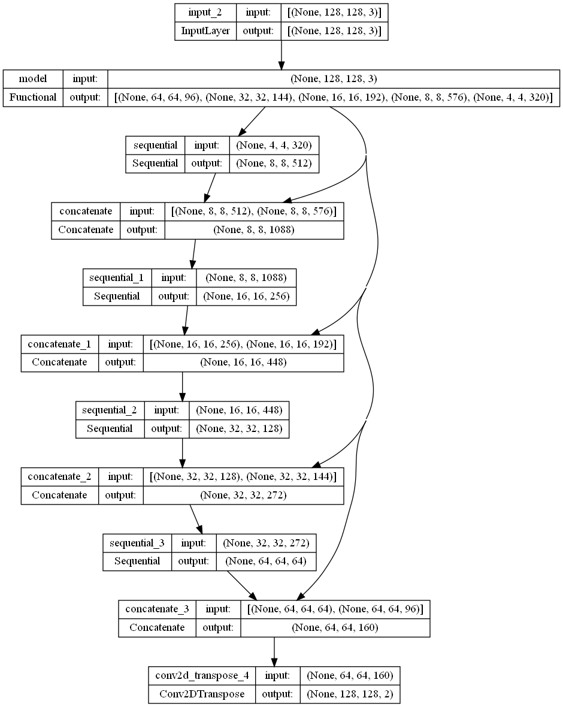
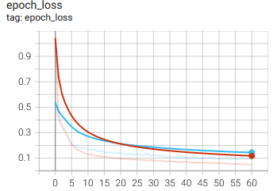
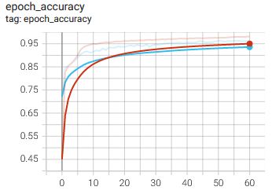

# Cell Nuclei Segmentation using U-Net

## 1. Summary
The aim of this project is to create an accurate deep learning model to detect and segment cell nuclei from biomdeical images, allowing cures to be made faster (researchers can understand the underlying biological processes of each cell). The model is trained with  dataset from [2018 Data Science Bowl dataset](https://www.kaggle.com/c/data-science-bowl-2018)

## 2. IDE and Framerowk
This project is created using Sypder as the main IDE. The main frameworks used in this project are Pandas, Scikit-learn and TensorFlow Keras.

## 3. Methodology
### 3.1. Data Pipeline
The data is first loaded and preprocessed, to ease computation. Pictures are used as inputs and image masks are used for labels. The train data is divided into train-validation sets, with a ratio of 80:20 ratio.

### 3.2. Model Pipeline
The U-Net model architecture was used for this project. You can refer to the TensorFlow documentation for further details. In summary, the model consist of two components, the downward stack, which serves as the feature extractor, and upward stack, which helps to produce pixel-wise output. The model structure is shown in the figure below.

The model is trained with a batch size of 128 and 200 epochs. Early stopping is also applied in the model training. The training stops at epoch 60, with a training accuracy of 97% and validation accuracy of 95%. The model training graphs are shown in figures below.

 

The graphs shows a clear sign of model convergence at an excellent convergence point.

## 4. Results
The model is evaluated with test data, which is shown in figure below.

Some predictions are also made with the model using some of the test data. The actual output masks and prediction masks are shown in figures below.

Overall, the model is capable of segmenting the cell nuclei with high accuracy.
